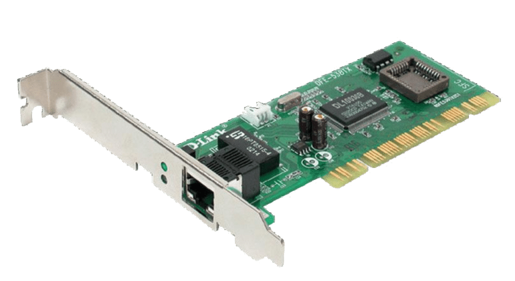

# NIC (Network Interface Card). 

> Fonte : https://www.researchgate.net/profile/Abdul-Hadi-Alaidi/publication/346108941/figure/fig3/AS:989391652667392@1612900760035/2-Network-Interface-Card-NIC.png

## It has a logic adress: 
* (IP - Internet Protocol) 
## And also a physic adress:
* (MAC - Media Access Control)
## SWITCH
* 24 to 48 ports. In which comutes (exchange or fowarding of information) the packages between devices.
## ROUTER
* Responsible for researching the best internet route to send packages from sender to recipient in the shortest possible time.
## MODEM
* Those ISPs provides internet to your house with this device, in which is a door for you to access the internet.

# STRUCTURED CABLING (STANDARDS)
### Standards that define how the organizations of their peripheral wires will be, enabling better organization and performance on the network.
* NBR 14.565.
* ANSI/TIA 568.
* ANSI/TIA 569.
## TWISTED PAIR
* UTP and STP (shielded).
## COAXIAL CABLE
* It is composed of copper wires, with a central wire, responsible for being the conductor of the electrical pulse, metallic mesh made in isolation and a plastic shield against external interference.
## OPTICAL FIBER
## RACK

# OSI and TCP/IP Model.

> Fonte: https://www.dltec.com.br/blog/redes/diferenca-entre-modelo-osi-e-tcp-ip/
## Layers
 * Aplication(Port) -> Protocols: DNS(53), SSH(22), HTTP(80), HTTPS(443), FTP(21), SMTP(25), IMAP(143), DHCP(67/68), NTP(123), etc.
 * Apresentation -> Responsible for translating, encrypting and compressing data so that it can be transferred efficiently and understandably between different systems. Protocols -> TLS, SSL.
 * Session -> Responsible for establishing, managing and terminating sessions between two machines that are communicating
   Protocols -> NetBIOS, PPTP, etc.
 * Transport -> SEGMENT. TCP(Connection-oriented protocol that provides reliable data delivery, flow control, and congestion control.)
             -> UDP(Connectionless protocol that provides fast data delivery but no guarantees of reliability or order.)
 
 * Network -> PROTOCOL IP(IPV4/IPV6) (PACKAGES ROUTER TO ROUTER) Responsible for determining the physical path that data must follow to reach its destination. It manages the logical addressing, routing and forwarding of packets, ensuring that data is transmitted correctly across different networks.
 * Link -> The data link layer organizes data into units called "frames". Each frame contains a header and trailer in addition to the top layer data. The link layer, therefore, plays a fundamental role in network communication, providing the basis for the secure and efficient transfer of data between devices on the same local network.
        -> Uses MAC (Media Access Control) addresses to identify devices on the local network. Each device has a unique MAC address.
        -> Protocols: Ethernet, Wi-Fi (IEEE 802.11) 

# IPV4 and IPV6
# NAT
* NAT (Network Address Translation) is a mechanism used in routers and firewalls to translate IP addresses between different networks. It allows multiple devices on a private network to share a single public IP address to communicate with devices on external networks such as the Internet. Here are the main aspects of NAT:
* In addition to translating IP addresses, NAT can also translate port numbers.
This is useful when multiple internal devices share the same public IP address. Each connection is distinguished by its unique port.
## IPV4
* IPv4 addresses are 32 bits long and are usually represented in dotted decimal notation, such as 192.168.1.1.
* Pode suportar cerca de 4,3 bilhões (2^32) de endereços únicos.
* Public Addresses: Used to identify devices on the internet (e.g.: 8.8.8.8).
* Private Addresses: Used in local networks (e.g.: 192.168.0.0 - 192.168.255.255).
## IPV6
* Hexadecimal notation with colons (colon-hexadecimal), for example: 2001:0db8:85a3:0000:0000:8a2e:0370:7334.
* IPv6: 3.4 x 10^38 addresses.
* Unicast addresses: Identify a single device.
* Anycast Addresses: An address assigned to multiple devices, the router sends to the closest one.
* Multicast Addresses: An address for a group of devices.
* Mandatory IPsec.

# Subnet Calculation
## Subnets (or subnets) are logical networks that arise from the division of a larger IP network into smaller networks. This is done through a process called "subnetting", which involves dividing the IP address space into smaller subnets. Here is an overview of how subnets work and how they are divided:
### The IPv4 address space is divided into smaller subnets using a subnet mask.
### The subnet mask identifies which part of the IP address is the network portion and which part is the host portion.
### For example, in a default subnet mask of /24, the first 24 bits are for the network and the last 8 bits are for the hosts.
### For a /24 subnet mask, for example, there are 2^8 (or 256) possible IP addresses, of which 2 are reserved for the network address(first) and the broadcast address(last), leaving 254 for hosts.
### The last IP address in a subnet is reserved for the broadcast address, used to send packets to all hosts in the subnet.For example, if a subnet has the mask /24, then 192.168.1.255 is the broadcast address.

> Fonte: https://pplware.sapo.pt/tutoriais/networking/classes-de-endereos-ip-sabe-quais-so/
